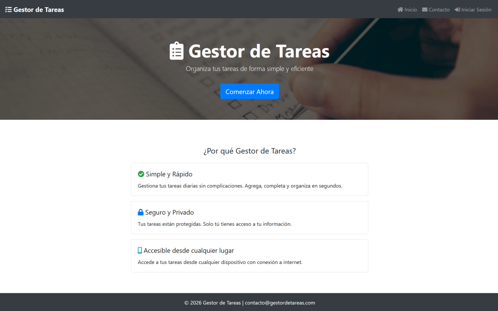
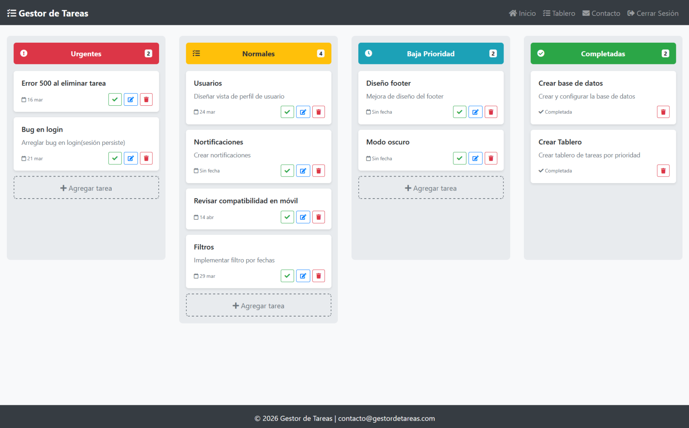

<h1 align="center">Task Manager</h1>

<p align="center">Gestor de tareas personal con tablero estilo Kanban.</p>

<p align="center">
  
  
</p>

---

## Descripción

**Task Manager** es una aplicación web para organizar tareas de forma visual en un tablero estilo Kanban. Diseñada para la gestión personal del trabajo diario, permite crear, priorizar y dar seguimiento a tareas con diferentes estados y fechas límite.

---

## Vista previa

<p align="center">
  <table>
    <tr>
      <td></td>
      <td></td>
    </tr>
    <tr>
      <td align="center">Pantalla principal</td>
      <td align="center">Gestor de tareas</td>
    </tr>
  </table>
</p>

---

## Funcionalidades

- Tablero Kanban para visualizar el estado de las tareas
- Creación de tareas con título, descripción, prioridad y fecha límite
- Prioridades: urgente, normal y baja
- Estados: pendiente y completada
- Autenticación de usuarios con sesiones

---

## Tecnologías

### Frontend
<p>
  
  
  
  
</p>

### Backend
<p>
  
  
  
  
</p>

---

## Arquitectura

La aplicación sigue una arquitectura backend basada en separación de responsabilidades:

```
routes/     →  manejan las solicitudes HTTP entrantes
models/     →  acceso y consultas a la base de datos
config/     →  configuración de conexión y variables de entorno
public/     →  interfaz web (HTML, CSS, JS)
```

Las rutas de tareas están protegidas mediante un middleware de autenticación basado en sesiones — solo usuarios con sesión activa pueden acceder a sus datos.

---

## API

### Autenticación

| Método | Ruta | Descripción |
|---|---|---|
| `GET` | `/login` | Página de inicio de sesión |
| `POST` | `/login` | Iniciar sesión |
| `GET` | `/registro` | Página de registro |
| `POST` | `/registro` | Registrar nuevo usuario |
| `GET` | `/logout` | Cerrar sesión |
| `GET` | `/session` | Consultar estado de sesión activa |

**POST /login y POST /registro — Body:**
```json
{
  "email": "usuario@ejemplo.com",
  "password": "minimo6caracteres"
}
```

**GET /session — Respuesta:**
```json
{ "logged": true, "email": "usuario@ejemplo.com" }
```

### Tareas

> Todas las rutas de tareas requieren sesión activa. Sin sesión, redirigen a `/login`.

| Método | Ruta | Descripción |
|---|---|---|
| `GET` | `/tasks` | Obtener todas las tareas del usuario |
| `POST` | `/tasks` | Crear una nueva tarea |
| `PUT` | `/tasks/:id` | Actualizar una tarea existente |
| `PUT` | `/tasks/:id/complete` | Marcar tarea como completada |
| `DELETE` | `/tasks/:id` | Eliminar una tarea |

**POST /tasks — Body:**
```json
{
  "title": "Nombre de la tarea",
  "description": "Descripción opcional",
  "priority": "urgente | normal | baja",
  "due_date": "2025-12-31"
}
```

**PUT /tasks/:id — Body:**
```json
{
  "title": "Nuevo título",
  "description": "Nueva descripción",
  "priority": "normal",
  "due_date": "2025-12-31"
}
```

---

## Ejecutar con Docker

1. Clona el repositorio y configura las variables de entorno:
```bash
git clone https://github.com/guillermosalado/task-manager.git
cd task-manager
cp .env.example .env
```

Edita el `.env` con tus credenciales:
```env
DB_HOST=db
DB_NAME=task_manager
DB_USER=tu_usuario
DB_PASSWORD=tu_password
DB_ROOT_PASSWORD=tu_root_password
```

2. Levanta los contenedores:
```bash
docker compose up --build
```

3. Abre tu navegador en `http://localhost:3000`

> El schema se importa automáticamente al iniciar los contenedores por primera vez.

| Servicio | Imagen | Descripción |
|---|---|---|
| `app` | `node:24-alpine` | Aplicación Node.js/Express |
| `db` | `mariadb:10.4.24` | Base de datos MariaDB |

---

## Instalación sin Docker

```bash
git clone https://github.com/guillermosalado/task-manager.git
cd task-manager
npm install
cp .env.example .env
mysql -u tu_usuario -p task_manager < database/schema.sql
node server.js
```

Abre tu navegador en `http://localhost:3000`

---

## Autor

| Nombre | GitHub |
|---|---|
| Guillermo López Salado | [guillermosalado](https://github.com/guillermosalado) |